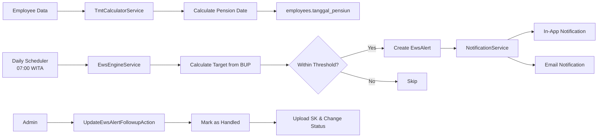
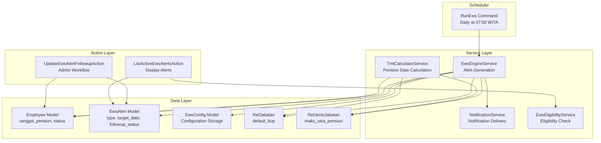
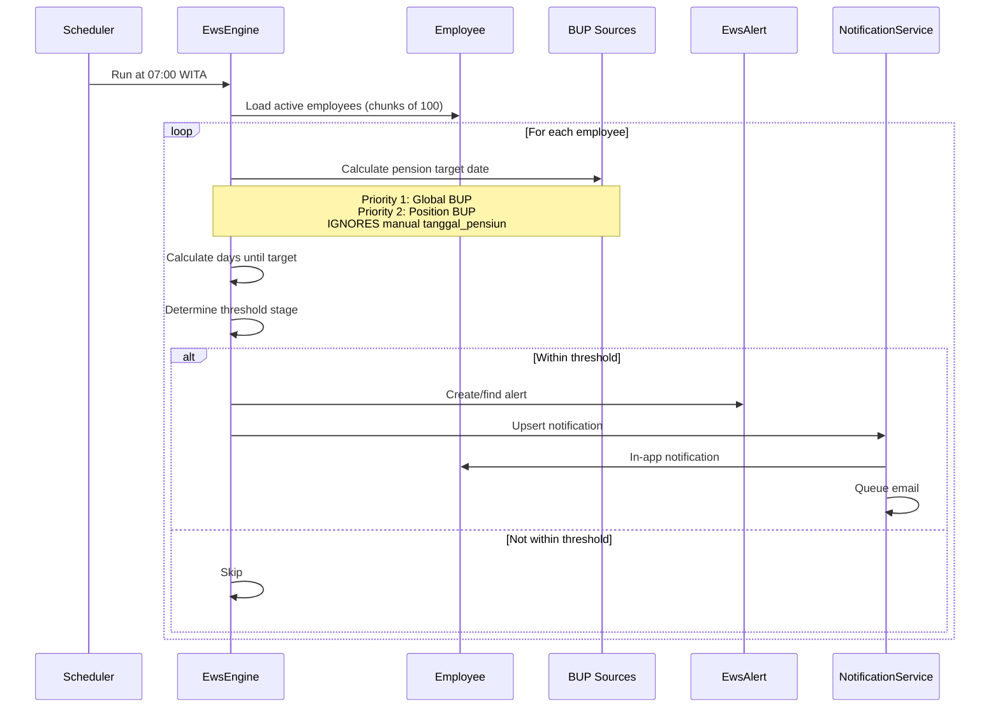
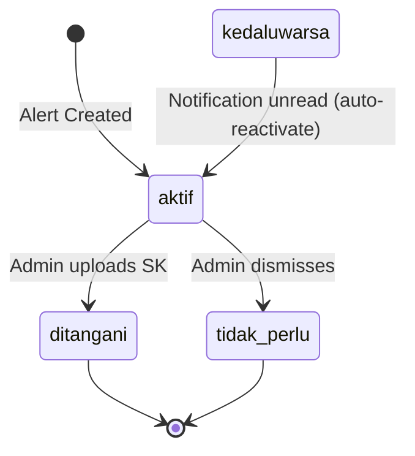
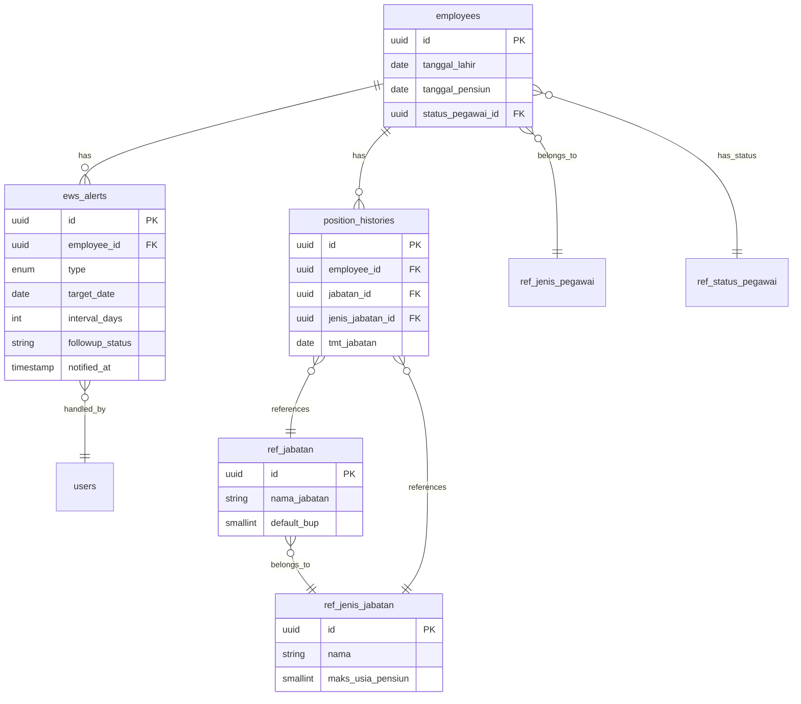

# Dokumentasi Teknis Sistem Pensiun & EWS SIMPEG

**Version:** 1.1
**Last Updated:** 25 Agustus 2026
**Author:** Development Team

> **Kontrak status aktif:** Dokumen ini mengikuti [Keputusan Lifecycle dan Status Pegawai](Keputusan-Lifecycle-Status-Pegawai-25-Agustus-2026.md). Contoh lama yang membandingkan `status_aktif = 'Aktif'` sudah superseded. EWS wajib memakai relasi `ref_status_pegawai.kelompok` melalui predicate kanonis; kelompok `Aktif` dan `Aktif/khusus` sama-sama aktif, sehingga Tugas Belajar tetap diproses.

---

## Table of Contents

1. [System Overview](#system-overview)
2. [Architecture & Component Map](#architecture--component-map)
3. [Pension Calculation Deep Dive](#pension-calculation-deep-dive)
4. [Early Warning System (EWS) Deep Dive](#early-warning-system-ews-deep-dive)
5. [Notification System](#notification-system)
6. [Admin Followup Workflow](#admin-followup-workflow)
7. [Configuration & Setup](#configuration--setup)
8. [Database Schema](#database-schema)
9. [API Reference](#api-reference)
10. [Integration Points](#integration-points)
11. [Testing & Quality](#testing--quality)
12. [Common Scenarios & Examples](#common-scenarios--examples)
13. [Known Issues & Limitations](#known-issues--limitations)
14. [Troubleshooting Guide](#troubleshooting-guide)
15. [Appendices](#appendices)

---

## 1. System Overview

### Purpose

SIMPEG's Pension and Early Warning System (EWS) provides **automated pension date calculation** and **proactive monitoring** for employees approaching retirement age. The system ensures no critical personnel milestones are missed by generating timely alerts to both employees and HR administrators.

### Two Main Subsystems

**1. Pension Calculation Engine**
- Automatically computes retirement dates based on BUP (Batas Usia Pensiun / Retirement Age Limit)
- Respects manual pension dates while recalculating when position history changes
- Integrates with employee, position, and reference data

**2. EWS Alert & Notification Engine**
- Monitors all active employees daily via scheduled job
- Generates alerts at configurable thresholds (default: H-365, H-180, H-90)
- **IMPORTANT:** Always calculates alerts from BUP, ignoring manual `tanggal_pensiun`
- Sends notifications via in-app and email channels
- Tracks followup status (aktif, ditangani, tidak_perlu, kedaluwarsa)

### High-Level Data Flow



### Key Capabilities

- **Automatic pension date calculation** from employee birth date and position BUP
- **Manual pension date support** for special cases (preserved in employee record)
- **Daily monitoring** of all active employees via scheduled job
- **Configurable alert thresholds** (H-365, H-180, H-90 for pension)
- **Multi-channel notifications** (in-app + email) to employees and admins
- **Followup workflow** for admin to handle alerts and update employee status
- **Complete audit trail** of all alert actions and status changes

### Critical Design Decision (Updated 2 Agustus 2026)

**EWS alerts ALWAYS calculate from BUP, never use manual `tanggal_pensiun`.**

**Rationale:**
- Manual pension dates may be set for administrative or special cases
- EWS monitoring should always follow organizational BUP policy
- Separates "official retirement date" (display) from "alert trigger date" (monitoring)
- Ensures consistent monitoring across all employees

**Impact:**
- `employees.tanggal_pensiun` is used for display purposes only
- EWS ignores this field when calculating alert target dates
- All alerts are based on BUP calculation: global override OR position-based BUP

---

## 2. Architecture & Component Map

### Component Diagram



### Service Layer

**TmtCalculatorService** (`app/Services/Employees/TmtCalculatorService.php`)
- Calculates pension dates from BUP sources
- Only fills `tanggal_pensiun` if null (preserves manual dates)
- Triggered after history changes (rank, position, salary)

**EwsEngineService** (`app/Services/EwsEngineService.php`)
- Daily scan of all active employees
- Generates alerts for 5 event types (KENAIKAN_PANGKAT, KGB, PENSIUN, KONTRAK_PPPK, SATYALANCANA)
- **For pension: ALWAYS calculates from BUP, ignores manual `tanggal_pensiun`**

**NotificationService** (`app/Services/NotificationService.php`)
- Creates/updates in-app notifications
- Dispatches email notifications via queue
- Implements upsert logic (refresh while unread, stop after read)

### Data Layer

**Employee** - Core employee data including `tanggal_lahir`, `tanggal_pensiun`, and `status_pegawai_id` linked to the canonical active classification
**EwsAlert** - Alert records with `type`, `target_date`, `interval_days`, `followup_status`  
**EwsConfig** - Key-value configuration storage  
**RefJabatan** - Position master with `default_bup` (position-specific BUP)  
**RefJenisJabatan** - Position type with `maks_usia_pensiun` (default BUP for type)

### Integration Points

- **Employee Management** → TmtCalculatorService (triggers recalculation)
- **Daily Scheduler** → EwsEngineService (07:00 WITA)
- **EwsEngineService** → NotificationService (alert notifications)
- **Admin UI** → UpdateEwsAlertFollowupAction (handle alerts)

---

## 3. Pension Calculation Deep Dive

### Formula & Logic

```
tanggal_pensiun = tanggal_lahir + BUP (years)
```

Where BUP (Batas Usia Pensiun) is the retirement age limit for the employee's position.

### BUP Source Priority

**File:** `app/Services/Employees/TmtCalculatorService.php` (lines 79-90)

| Priority | Source | Field | When Used |
|----------|--------|-------|-----------|
| 1 | Position | `ref_jabatan.default_bup` | Position-specific override (e.g., 60 for structural positions) |
| 2 | Position Type | `ref_jenis_jabatan.maks_usia_pensiun` | Default for position type (e.g., 58 for standard staff) |
| 3 | Manual/Import | `employees.tanggal_pensiun` | Preserved as-is, never overwritten by calculation |

**Code:**
```php
// File: app/Services/Employees/TmtCalculatorService.php (lines 79-90)
private function pensionDate(Employee $employee): ?Carbon
{
    if ($employee->tanggal_lahir === null) {
        return null;
    }
    
    $position = $this->latestPosition($employee);
    
    // Priority 1: Position-specific BUP
    $bup = $position?->jabatan?->default_bup 
        // Priority 2: Position type BUP
        ?? $position?->jenisJabatan?->maks_usia_pensiun;
    
    if ($bup === null) {
        return null;
    }
    
    return $employee->tanggal_lahir->copy()->addYearsNoOverflow($bup);
}
```

### Trigger Points

**When calculation IS triggered:**
- Creating employee with position/rank/salary history → `CreateEmployeeAction.php` (lines 165-167)
- Updating employee history → `UpdateEmployeeAction.php` (lines 212-214)
- Creating position history → `EmployeeHistoryService.php` (line 169)
- Creating rank history → `EmployeeHistoryService.php` (line 64)
- Creating salary history → `EmployeeHistoryService.php` (line 215)

**When calculation is NOT triggered:**
- During CSV/Excel import → `ImportEmployeesAction.php` (lines 84-96)
- **Design decision:** Import preserves manual `tanggal_pensiun` values

### Edge Cases

**Missing BUP data:**
- Returns `null` if no BUP found in position or position type
- Employee pension date remains `null` until BUP data added

**Multiple positions:**
- Uses latest position by `tmt_jabatan DESC, created_at DESC, id DESC`
- Historical positions don't affect current pension date

**Manual overrides:**
- Guard at line 32: `if ($employee->tanggal_pensiun === null)`
- Existing manual dates are NEVER overwritten
- To recalculate: set to `null` first, then trigger calculation

**Leap year handling:**
- Uses `addYearsNoOverflow()` method
- Feb 29 birth date + N years → Feb 28 (no March 1 overflow)

### Common BUP Values

| Position Type | BUP (Years) | Source |
|---------------|-------------|--------|
| Standard Staff / Pelaksana | 58 | `ref_jenis_jabatan.maks_usia_pensiun` |
| Structural / Pimpinan | 60 | `ref_jabatan.default_bup` |
| Academic / Dosen | 65-70 | `ref_jabatan.default_bup` (future phase) |

---

## 4. Early Warning System (EWS) Deep Dive

### Daily Monitoring Flow



### Target Date Calculation Logic

**CRITICAL CHANGE (2 Agustus 2026):** EWS now ALWAYS calculates from BUP, ignoring manual `tanggal_pensiun`.

**File:** `app/Services/EwsEngineService.php` (lines 156-162)

```php
// 3. Pensiun — EWS alert SELALU pakai kalkulasi BUP, bukan tanggal_pensiun manual.
$targetDate = null;
if ($pensiunRequiredAgeYears > 0 && $employee->tanggal_lahir) {
    $targetDate = Carbon::parse($employee->tanggal_lahir)->addYears($pensiunRequiredAgeYears);
} else {
    $targetDate = $this->calculatePensionFromPositionBup($employee);
}
```

**Priority:**
1. **Global BUP override** (`pensiun_required_age_years` > 0): `birth_date + global_years`
2. **Position BUP calculation**: Use `calculatePensionFromPositionBup()` method

**New Method:** `calculatePensionFromPositionBup()` (lines 320-348)
- Mirrors `TmtCalculatorService` logic for consistency
- Fetches latest position by `tmt_jabatan DESC, created_at DESC, id DESC`
- Returns BUP from `jabatan.default_bup` OR `jenisJabatan.maks_usia_pensiun`
- Returns `null` if no birth date, no position, or no BUP

### Alert Stages & Thresholds

**Default configuration** (from `EwsConfigSeeder.php`):

| Stage | Days Before | Description |
|-------|-------------|-------------|
| H-365 | 365 | 1 year advance notice |
| H-180 | 180 | 6 months advance notice |
| H-90 | 90 | 3 months urgent notice |

**Configuration keys:**
- `pensiun_required_age_years` = 0 (disabled, use position BUP)
- `pensiun_y1` = 365
- `pensiun_m6` = 180
- `pensiun_m3` = 90

### Stage Determination Algorithm

**File:** `app/Services/EwsEngineService.php` (lines 306-318)

```php
private function dueStage(array $stages, int $diffDays): ?int
{
    $stages = array_values(array_unique(array_filter($stages, fn (int $days): bool => $days >= 0)));
    sort($stages);  // [90, 180, 365]

    foreach ($stages as $stage) {
        if ($diffDays <= $stage) {
            return $stage;  // Returns first (smallest) matching stage
        }
    }

    return null;  // No stage applies yet
}
```

**How it works:**
- Filters negative values, removes duplicates, sorts ascending
- Returns **smallest threshold** that employee has reached
- Alert continues even **after target date passes** (last stage persists)

**Example:**
- 400 days until retirement → No alert
- 300 days → H-365 alert
- 150 days → H-180 alert
- 60 days → H-90 alert
- -10 days (past retirement) → H-90 alert continues until manually handled

### Duplicate Prevention

**Unique constraint:** `(employee_id, type, target_date, interval_days)`

**File:** `app/Services/EwsEngineService.php` (lines 342-366)

```php
$findAlert = fn () => EwsAlert::query()
    ->where('employee_id', $employee->id)
    ->where('type', $type)
    ->whereDate('target_date', $targetDate)
    ->where('interval_days', $days);
$alert = $findAlert()->first();

if ($alert === null) {
    try {
        $alert = EwsAlert::create([...]);
        $wasCreated = true;
    } catch (QueryException $exception) {
        // Race condition: another process created it
        $alert = $findAlert()->first();
        if ($alert === null) {
            throw $exception;
        }
    }
}
```

**Prevents:**
- Same alert created multiple times per day
- Duplicate notifications

**Handles:**
- Race conditions from concurrent scheduler runs
- Unique key violations gracefully

---

## 5. Notification System

### Notification Channels

**In-App Notifications**
- Table: `simpeg_notifications`
- Visible in notification bell
- Refreshed daily while unread

**Email Notifications**
- Job: `SendSimpegNotificationEmailJob`
- Queue: default (3 retries)
- Template: Bahasa Indonesia
- Sent only on first creation (not on refreshes)

### Recipient Resolution

**File:** `app/Services/Notifications/NotificationRecipientResolver.php` (lines 22-72)

**For pension alerts:**

| Recipient Type | Role | Channel |
|----------------|------|---------|
| Primary | Employee (subject of alert) | In-app + Email |
| Additional | Admin Kepegawaian | In-app + Email |

**Deduplication:**
- If employee is also Admin Kepegawaian → receives only 1 notification
- Uses `unique('id')` on recipient collection

### Notification Upsert Logic

**File:** `app/Services/NotificationService.php` (lines 66-147)

**Flow:**
1. Check if notification exists for this alert
2. If exists and **read** → stop refreshing (mark acknowledged)
3. If exists and **unread** → refresh content (update message)
4. If not exists and **not acknowledged** → create new
5. Fan out email to additional recipients (only on creation)

**Code snippet:**
```php
$notification = SimpegNotification::query()
    ->where('user_id', $employee->id)
    ->where('ews_alert_id', $alert->id)
    ->first();

if ($notification !== null) {
    if ($notification->is_read) {
        // Stop refreshing after read
        $alert->notification_acknowledged_at = $notification->read_at;
        return $notification;
    }
    
    // Refresh unread notification
    $notification->fill($attributes)->save();
    return $notification->refresh();
}

// Create new if not acknowledged
if ($alert->notification_acknowledged_at !== null) {
    return null;  // User already saw and dismissed it
}

$notification = SimpegNotification::create([...]);
```

**Key behavior:**
- **Before read:** Notification content refreshed daily (updated dates)
- **After read:** No more refreshes, alert marked as acknowledged
- **Email:** Sent only once (on first creation), not on refreshes

---

## 6. Admin Followup Workflow

### Workflow States

**File:** `app/Models/EwsAlert.php` (lines 29-35)

| Status | Const | Description | Next Actions |
|--------|-------|-------------|--------------|
| **aktif** | `FOLLOWUP_STATUS_ACTIVE` | Requires admin action | Mark as handled or not needed |
| **ditangani** | `FOLLOWUP_STATUS_HANDLED` | Admin processed (SK uploaded, status changed) | View only |
| **tidak_perlu** | `FOLLOWUP_STATUS_NOT_NEEDED` | Admin dismissed as not applicable | View only |
| **kedaluwarsa** | `FOLLOWUP_STATUS_EXPIRED` | Legacy status, auto-reverts to aktif if unread | Auto-handled by system |

### State Transition Diagram



### Pension Approval Process

**File:** `app/Actions/Ews/UpdateEwsAlertFollowupAction.php`

**Steps** (lines 51-53, 139-157):

1. **Validate alert is active**
   ```php
   if ($alert->followup_status !== EwsAlert::FOLLOWUP_STATUS_ACTIVE) {
       throw ValidationException::withMessages([...]);
   }
   ```

2. **Upload SK document** (lines 142-144)
   ```php
   $pensionStatus = RefStatusPegawai::query()->where('kode', 'PENSIUN')->firstOrFail();
   $filePath = $this->files->storeSk($request->file('file_sk'));
   ```

3. **Create document record** (lines 146-153)
   ```php
   $employee->documents()->create([
       'jenis_dokumen' => 'sk_pensiun',
       'nama_dokumen' => 'SK Pensiun',
       'nomor_dokumen' => (string) $request->input('no_sk'),
       'tanggal_dokumen' => (string) $request->input('tanggal_sk'),
       'file_path' => $filePath,
       'keterangan' => 'Diunggah saat persetujuan EWS Pensiun.',
   ]);
   ```

4. **Change employee status** (line 154)
   ```php
   $employee->update(['status_pegawai_id' => $pensionStatus->id]);
   ```

5. **Close ALL pension alerts** (lines 169-191)
   - Finds all ACTIVE pension alerts for this employee (all stages: H-365, H-180, H-90)
   - Marks ALL as HANDLED (not just the one admin clicked)
   - Marks all unread notifications as read
   - **Why:** Pension is a one-time event, all stages become irrelevant once handled

6. **Create audit log**
   ```php
   AuditService::log('UPDATE', 'EwsAlert', $alert->id, $before, $after, $request);
   ```

**Required fields:**
- `no_sk` - SK document number
- `tanggal_sk` - SK date
- `file_sk` - Uploaded SK file (PDF)

**Side effects:**
- Employee status may change to a reference whose `kelompok` is not `Aktif`/`Aktif/khusus`
- Future scheduler runs skip the employee only when `whereActiveStatus()` no longer includes the effective status
- All pension notifications disappear from employee's notification bell

### Rollback Compensation

**File:** `app/Actions/Ews/UpdateEwsAlertFollowupAction.php` (lines 68-77)

**Problem:** SK file uploaded to storage inside transaction, but rollback doesn't delete file

**Solution:**
```php
try {
    $alert = DB::transaction(function () use (..., &$storedSkPaths) {
        // Upload SK and store path
        $storedSkPaths[] = $this->approveRetirement(...);
        // ... rest of transaction
    });
} catch (\Throwable $exception) {
    // Manual compensation: delete orphaned files
    foreach (array_filter($storedSkPaths) as $storedSkPath) {
        $this->files->deletePublicFile($storedSkPath);
    }
    throw $exception;
}
```

---

## 7. Configuration & Setup

### EWS Configuration Table

**Table:** `ews_configs` (key-value storage)

**Pension-related keys:**

| Key | Default | Description |
|-----|---------|-------------|
| `pensiun_required_age_years` | 0 | Global BUP override (0 = disabled, use position BUP) |
| `pensiun_y1` | 365 | H-1 year threshold (days before retirement) |
| `pensiun_m6` | 180 | H-6 months threshold |
| `pensiun_m3` | 90 | H-3 months threshold |
| `ews_scheduler_time` | 07:00 | Daily run time (HH:MM format, WITA timezone) |

**File:** `database/seeders/EwsConfigSeeder.php` (lines 22-25)

**Access via:**
```php
// Read
$value = EwsConfig::getVal('pensiun_required_age_years', '0');

// Write
EwsConfig::setVal('pensiun_required_age_years', '60');
```

### Scheduler Setup

**Command:** `php artisan app:run-ews`

**File:** `app/Console/Commands/RunEws.php`

**Laravel scheduler registration:**
```php
// File: routes/console.php
use App\Services\EwsEngineService;

Schedule::call(function () {
    app(EwsEngineService::class)->run();
})->dailyAt(EwsConfig::getVal('ews_scheduler_time', '07:00'));
```

**Manual trigger (for testing):**
```bash
php artisan app:run-ews
```

**Cron setup (production):**
```bash
* * * * * cd /path/to/simpeg && php artisan schedule:run >> /dev/null 2>&1
```

### Position BUP Configuration

**Via admin panel:**
1. Navigate to Data Master → Jabatan
2. Edit specific position (e.g., "Kepala Bagian")
3. Set `default_bup` field (e.g., 60 for structural positions)
4. Leave empty to use position type default

**Via admin panel:**
1. Navigate to Data Master → Jenis Jabatan
2. Edit position type (e.g., "Struktural")
3. Set `maks_usia_pensiun` field (e.g., 60)
4. This becomes default for all positions of this type

**Database direct:**
```sql
-- Set specific position BUP
UPDATE ref_jabatan SET default_bup = 60 WHERE nama_jabatan = 'Kepala Bagian';

-- Set position type default BUP
UPDATE ref_jenis_jabatan SET maks_usia_pensiun = 58 WHERE nama = 'Fungsional Umum';
```

**Common values:**
- 58: Standard staff (Pelaksana, Fungsional Umum)
- 60: Structural positions (Struktural, Pimpinan Tinggi)
- 65-70: Academic positions (Dosen, prepared for future phase)

### Validation Rules

**File:** `app/Http/Requests/Ews/UpdateEwsConfigRequest.php` (lines 34-37, 120-121)

```php
'pensiun_required_age_years' => 'required|integer|min:0|max:100',
'pensiun_y1' => 'required|integer|min:1',
'pensiun_m6' => 'required|integer|min:1',
'pensiun_m3' => 'required|integer|min:1',
```

**Stage order validation:**
```php
['pensiun_y1', 'pensiun_m6', 'Pensiun Tahap 1 harus lebih besar dari Tahap 2.'],
['pensiun_m6', 'pensiun_m3', 'Pensiun Tahap 2 harus lebih besar dari Tahap 3.'],
```

Ensures: **H-365 > H-180 > H-90** (descending order)

**Effect of configuration changes:**
- Takes effect immediately (no cache, no restart needed)
- Existing alerts remain unchanged (historical record)
- New alerts use new thresholds
- Scheduler picks up new time on next run

---

## 8. Database Schema

### Core Tables

#### employees

**File:** `database/migrations/2026_06_18_100002_create_employees_table.php`

**Pension-related columns:**
```sql
tanggal_lahir         DATE NULL           -- Birth date for BUP calculation
tanggal_pensiun       DATE NULL           -- Calculated or manual pension date
status_pegawai_id     UUID                -- FK to ref_status_pegawai
```

**Purpose:**
- `tanggal_lahir` + BUP = `tanggal_pensiun`
- `ref_status_pegawai.kelompok IN ('Aktif', 'Aktif/khusus')` determines if Employee is scanned by EWS, exposed through the canonical active scope
- `tanggal_pensiun` can be manual (preserved) or calculated (filled if null)

#### ews_alerts

**File:** `database/migrations/2026_06_18_100013_create_ews_alerts_table.php`

**Schema:**
```sql
id                    UUID PRIMARY KEY
employee_id           UUID NOT NULL FK → employees.id CASCADE
type                  ENUM('KENAIKAN_PANGKAT','KGB','PENSIUN','KONTRAK_PPPK','SATYALANCANA')
target_date           DATE NOT NULL       -- Alert target date (from BUP calculation)
interval_days         INT NOT NULL        -- Threshold stage (365, 180, 90)
followup_status       VARCHAR(50)         -- 'aktif','ditangani','tidak_perlu','kedaluwarsa'
notified_at           TIMESTAMP NULL      -- Last notification sent
notification_acknowledged_at  TIMESTAMP NULL  -- When user read notification
handled_at            TIMESTAMP NULL      -- When admin marked as handled
handled_by            UUID NULL FK → users.id
handled_note          TEXT NULL           -- Admin notes
is_eligible           BOOLEAN NULL        -- Eligibility snapshot (not for pension)
satyalancana_years    INT NULL            -- Milestone years (only for SATYALANCANA)
created_at, updated_at TIMESTAMP
```

**Key constraint:**
```sql
UNIQUE(employee_id, type, target_date, interval_days)
```

**Purpose:**
- Prevents duplicate alerts
- One alert per employee × event type × target date × threshold stage

#### ews_configs

**File:** `database/migrations/2026_06_23_000003_create_ews_configs_table.php`

**Schema:**
```sql
id          UUID PRIMARY KEY
key         VARCHAR(255) UNIQUE NOT NULL
value       TEXT NOT NULL
created_at, updated_at  TIMESTAMP
```

**Example rows:**
```sql
('pensiun_required_age_years', '0')
('pensiun_y1', '365')
('pensiun_m6', '180')
('pensiun_m3', '90')
```

#### ref_jabatan

**File:** `database/migrations/2026_07_20_000000_complete_phase_one_reference_tables.php`

**Pension-related columns:**
```sql
id                UUID PRIMARY KEY
nama_jabatan      VARCHAR(100)
jenis_jabatan_id  UUID FK → ref_jenis_jabatan.id
default_bup       SMALLINT NULL      -- Position-specific BUP override (e.g., 60)
is_active         BOOLEAN DEFAULT true
```

**Purpose:**
- `default_bup` overrides position type default
- Used for structural positions with different retirement ages

#### ref_jenis_jabatan

**File:** `database/migrations/2026_06_18_100000_create_reference_tables.php`

**Schema:**
```sql
id                  UUID PRIMARY KEY
nama                VARCHAR(100)
maks_usia_pensiun   SMALLINT NOT NULL  -- Default BUP for this position type
catatan             VARCHAR(255) NULL
```

**Example rows:**
```sql
('Struktural', 60)
('Fungsional Umum', 58)
('Fungsional Tertentu', 58)
```

### Entity Relationship Diagram



### Key Indexes

**ews_alerts:**
- `employee_id` (for querying alerts by employee)
- `type` (for filtering by event type)
- `followup_status` (for querying active alerts)
- `UNIQUE(employee_id, type, target_date, interval_days)` (duplicate prevention)

**employees/ref_status_pegawai:**
- `employees.status_pegawai_id` and the indexed/reference classification used by `whereActiveStatus()` (for EWS daily scan)
- `jenis_pegawai_id` (for PPPK filtering)

---

## 9. API Reference

### TmtCalculatorService

**File:** `app/Services/Employees/TmtCalculatorService.php`

#### `syncForEmployee(Employee $employee): void`

**Purpose:** Synchronizes all computed dates (pension, promotion, KGB) for an employee.

**Lines:** 17-41

**Behavior:**
- Calculates pension date only if `tanggal_pensiun` is `null`
- Calculates promotion date from latest rank history
- Calculates KGB date from latest salary history
- Updates employee record with computed values

**Usage:**
```php
use App\Services\Employees\TmtCalculatorService;

$calculator = app(TmtCalculatorService::class);
$calculator->syncForEmployee($employee);

// Employee now has:
// - tanggal_pensiun (if was null)
// - tanggal_kenaikan_pangkat_berikutnya
// - tanggal_kgb_berikutnya
```

**Called by:**
- `CreateEmployeeAction` (after creating with history)
- `UpdateEmployeeAction` (after updating history)
- `EmployeeHistoryService` (after adding rank/position/salary history)

#### `pensionDate(Employee $employee): ?Carbon` (private)

**Purpose:** Calculates pension date from BUP sources.

**Lines:** 79-90

**Returns:** `Carbon` date or `null` if calculation not possible

**Algorithm:**
1. Get latest position by `tmt_jabatan DESC, created_at DESC, id DESC`
2. Check `position->jabatan->default_bup` (priority 1)
3. Fallback to `position->jenisJabatan->maks_usia_pensiun` (priority 2)
4. Return `tanggal_lahir + BUP years` (using `addYearsNoOverflow`)

---

### EwsEngineService

**File:** `app/Services/EwsEngineService.php`

#### `run(): void`

**Purpose:** Main entry point for daily EWS scan.

**Lines:** 26-292

**Behavior:**
1. Creates `EwsSchedulerRun` record (status: `sedang_berjalan`)
2. Loads EWS configuration (thresholds, periods)
3. Scans all active employees through `whereActiveStatus()` (`kelompok` `Aktif` or `Aktif/khusus`) in chunks of 100
4. For each employee, checks all 5 event types
5. Creates alerts if thresholds met
6. Updates scheduler run record (status: `berhasil` or `gagal`)
7. On failure, notifies Super Admin

**Usage:**
```php
use App\Services\EwsEngineService;

$engine = app(EwsEngineService::class);
$engine->run();
// Returns void, logs to ews_scheduler_runs table
```

**Scheduled via:**
```php
Schedule::call(function () {
    app(EwsEngineService::class)->run();
})->dailyAt('07:00');
```

#### `calculatePensionFromPositionBup(Employee $employee): ?Carbon` (private)

**Purpose:** Calculates pension date from position BUP for EWS alerts.

**Lines:** 320-348 (newly added)

**Returns:** `Carbon` date or `null`

**Why separate from TmtCalculatorService:**
- EWS ALWAYS calculates from BUP (ignores manual `tanggal_pensiun`)
- TmtCalculatorService respects manual dates
- This method ensures consistency with TmtCalculatorService logic

**Algorithm:**
```php
1. Return null if no tanggal_lahir
2. Get latest position (same order as TmtCalculatorService)
3. Get BUP: jabatan.default_bup ?? jenisJabatan.maks_usia_pensiun
4. Return tanggal_lahir + BUP years (using addYearsNoOverflow)
```

#### `createAlertIfNotExist(...): bool` (protected)

**Purpose:** Creates single alert with notification, handles duplicates.

**Lines:** 326-418

**Parameters:**
```php
Employee $employee
string $type              // 'PENSIUN', 'KENAIKAN_PANGKAT', etc.
string $targetDate        // Alert target date (Y-m-d format)
int $days                 // Threshold stage (365, 180, 90)
string $titleLabel        // 'Pensiun', 'Kenaikan Pangkat', etc.
?bool $isEligible = null  // Eligibility (null for pension - no check)
?int $satyalancanaYears = null  // Milestone years (only SATYALANCANA)
```

**Returns:** `true` if new alert created, `false` if already exists

**Behavior:**
1. Check if alert exists (employee × type × target_date × interval_days)
2. If not, create new alert (catch race condition)
3. Build notification message
4. Upsert notification via `NotificationService`
5. Update `notified_at` timestamp
6. Reactivate expired alerts if notification unread

---

### UpdateEwsAlertFollowupAction

**File:** `app/Actions/Ews/UpdateEwsAlertFollowupAction.php`

#### `execute(EwsAlert $alert, string $followupStatus, string $handledNote, Request $request): EwsAlert`

**Purpose:** Handles admin followup for EWS alerts.

**Lines:** 30-97

**Parameters:**
```php
EwsAlert $alert           // The alert being handled
string $followupStatus    // 'ditangani' or 'tidak_perlu'
string $handledNote       // Admin notes
Request $request          // HTTP request (for SK upload if pension)
```

**Returns:** Updated `EwsAlert` model

**Behavior:**

**For pension (`type='PENSIUN'` + `followupStatus='ditangani'`):**
1. Validate alert is active
2. Upload SK document
3. Create document record
4. Change employee status to "Pensiun"
5. Close ALL pension alerts for this employee (all stages)
6. Mark all unread pension notifications as read
7. Create audit log
8. On failure: delete uploaded SK (rollback compensation)

**For other types or `tidak_perlu`:**
1. Close alerts of same type
2. Mark notifications as read
3. Create audit log

**Required fields (pension):**
```php
$request->input('no_sk')      // SK number
$request->input('tanggal_sk') // SK date
$request->file('file_sk')     // Uploaded PDF
```

**Validation:**
```php
// File: app/Http/Requests/Ews/UpdateEwsAlertFollowupRequest.php
'no_sk' => 'required|string|max:100'
'tanggal_sk' => 'required|date'
'file_sk' => 'required|file|mimes:pdf|max:2048'  // 2MB
```

---

## 10. Integration Points

### Employee Management Integration

**Trigger:** Creating or updating employee with history changes

**Files:**
- `app/Actions/Employees/CreateEmployeeAction.php` (lines 165-167)
- `app/Actions/Employees/UpdateEmployeeAction.php` (lines 212-214)

**Flow:**
```
User creates/updates employee via UI
  ↓
CreateEmployeeAction / UpdateEmployeeAction
  ↓
If history changed (rank/position/salary)
  ↓
TmtCalculatorService::syncForEmployee()
  ↓
Calculate tanggal_pensiun (if null)
  ↓
Update employee record
```

**Code:**
```php
// CreateEmployeeAction.php (lines 165-167)
if ($sourceHistoryChanged) {
    $this->tmtCalculator->syncForEmployee($employee);
}

// UpdateEmployeeAction.php (lines 212-214)
if ($rankHistoryChanged || $positionHistoryChanged || $salaryHistoryChanged) {
    $this->tmtCalculator->syncForEmployee($employee);
}
```

**Status change impact:**
- When employee status effectively changes to "Pensiun", its referenced `kelompok` is not active
- EWS scheduler skips employees excluded by `whereActiveStatus()`; `Aktif/khusus`, including Tugas Belajar, remains included
- Future alerts not generated for retired employees

---

### Position Management Integration

**Trigger:** Adding or updating position history

**File:** `app/Services/EmployeeHistoryService.php` (line 169)

**Flow:**
```
Admin adds position history
  ↓
EmployeeHistoryService::createPositionHistory()
  ↓
Save PositionHistory record (with jabatan_id, jenis_jabatan_id)
  ↓
TmtCalculatorService::syncForEmployee()
  ↓
Recalculate pension date from new position's BUP
  ↓
Update employee.tanggal_pensiun (if null)
```

**BUP data source:**
```php
$position->jabatan->default_bup          // Position-specific (priority 1)
$position->jenisJabatan->maks_usia_pensiun  // Position type default (priority 2)
```

**Why position triggers recalculation:**
- Different positions have different BUPs
- Promotion from staff (58) to structural (60) extends retirement age by 2 years
- EWS alerts automatically adjust to new target date

**Historical snapshots:**
- `PositionHistory.jenis_jabatan_id` stores snapshot at assignment time
- Protects against master table changes breaking historical records

---

### Import System Integration

**Trigger:** CSV/Excel import of employee data

**File:** `app/Actions/Employees/ImportEmployeesAction.php` (lines 84-96)

**Flow:**
```
Admin uploads CSV/Excel
  ↓
Parse and validate rows
  ↓
For each valid row:
  Employee::create([...])  // Direct create, NO history, NO calculation
  ↓
Import complete
```

**CRITICAL:** Import does **NOT** call `TmtCalculatorService`

**Design decision:**
- Import preserves manual `tanggal_pensiun` values as-is
- No automatic calculation during bulk import
- Imported dates are considered authoritative

**To trigger calculation post-import:**
- Add position history via UI → triggers `TmtCalculatorService`
- Manually set `tanggal_pensiun=NULL` → add history → recalculates

**Mapper:**
```php
// File: app/Support/EmployeeImport/EmployeeRowMapper.php (line 70)
'Pensiun' => 'tanggal_pensiun',  // Direct mapping, no processing
```

---

### Daily Scheduler Integration

**Trigger:** Laravel scheduler (cron)

**File:** `routes/console.php`

**Flow:**
```
Cron runs Laravel scheduler (every minute)
  ↓
Laravel checks scheduled tasks
  ↓
At 07:00 WITA: Run EWS
  ↓
EwsEngineService::run()
  ↓
Scan all active employees
  ↓
For each: Calculate target dates, create alerts, send notifications
```

**Configuration:**
```php
// Cron (production)
* * * * * cd /path/to/simpeg && php artisan schedule:run

// Scheduler registration
Schedule::call(function () {
    app(EwsEngineService::class)->run();
})->dailyAt(EwsConfig::getVal('ews_scheduler_time', '07:00'));
```

**Manual trigger:**
```bash
php artisan app:run-ews
```

---

## 11. Testing & Quality

### Unit Tests

#### TmtCalculatorServiceTest

**File:** `tests/Unit/TmtCalculatorServiceTest.php`

**Coverage:**

| Test | Lines | Scenario |
|------|-------|----------|
| `test_uses_latest_dated_sources` | 42 | Ignores backdated records, uses latest by TMT date |
| `test_null_tmt_sources_do_not_replace_existing` | 62 | Null TMT in history doesn't clear existing snapshot |
| `test_equal_tmt_prefers_newer_created_at` | 84 | Tie-breaker: same TMT → newer `created_at` wins |
| `test_equal_tmt_and_created_at_uses_id_desc` | 98 | Deterministic fallback: use `id DESC` |
| `test_existing_pension_dates_are_preserved` | 116 | **CRITICAL:** Manual `tanggal_pensiun` never overwritten |
| `test_pension_uses_jabatan_default_bup` | 130 | Position BUP priority over position type |
| `test_pension_falls_back_to_jenis_jabatan_bup` | 142 | Position type BUP when position has no override |
| `test_pension_uses_position_history_jenis_jabatan` | 156 | Uses historical snapshot, not current master |
| `test_pension_returns_null_when_no_position_reference` | 186 | Graceful null when position data missing |
| `test_clearing_sources_clears_derived_snapshots` | 203 | Removing history clears computed dates |
| `test_leap_day_calculation_uses_no_overflow` | 220 | Feb 29 + N years → Feb 28 (no March 1) |

**Run:**
```bash
php artisan test --filter=TmtCalculatorServiceTest
```

---

### Feature Tests

#### EwsSchedulerTest

**File:** `tests/Feature/EwsSchedulerTest.php`

**Key tests:**

**`test_scheduler_uses_configured_event_periods_for_all_ews_types()`** (lines 36-114)
- Tests all 5 event types with custom config
- Sets `pensiun_required_age_years=55` (global BUP)
- Verifies pension alert created at H-3 (custom threshold)

**`test_scheduler_checks_pensiun_trigger()`** (lines 235-265)
- **UPDATED:** Now uses BUP calculation instead of manual date
- Creates employee with `tanggal_lahir` and position history
- Verifies alert created at H-365 based on BUP, not manual date

**`test_ews_ignores_manual_pension_date_and_uses_bup()`** (lines 267-305)
- **NEW TEST (2 Agustus 2026)**
- Creates employee with manual `tanggal_pensiun` = 365 days away
- But BUP calculation = 180 days away
- **Verifies alert uses BUP (180), not manual date (365)**

**`test_scheduler_prevents_duplicate_alerts()`** (lines 538-551)
- Runs scheduler twice
- Verifies alert count remains 1 (not 2)

**Run:**
```bash
php artisan test --filter=EwsSchedulerTest
```

---

#### EwsFollowupTest

**File:** `tests/Feature/EwsFollowupTest.php`

**Key tests:**

**`test_pension_approval_uploads_sk_sets_employee_to_pensiun_and_stops_reminders()`** (lines 230-277)
- Creates employee with 2 pension alerts (H-90, H-180)
- Admin marks H-90 as handled with SK upload
- **Verifies:**
  - Employee status changed to 'Pensiun'
  - SK document created
  - **BOTH** H-90 and H-180 alerts marked as HANDLED
  - **BOTH** notifications marked as read
  - Audit log created

**`test_failed_pension_followup_cleans_up_uploaded_sk_file()`** (lines 318-356)
- Simulates transaction failure after SK upload
- Verifies uploaded file deleted (rollback compensation)
- Employee status remains 'Aktif'

**`test_pension_approval_requires_sk_data()`** (lines 404-418)
- Validates required fields: `no_sk`, `tanggal_sk`, `file_sk`
- Returns validation errors if missing

**Run:**
```bash
php artisan test --filter=EwsFollowupTest
```

---

### Test Data Setup

**Seeders used:**
- `ReferenceSeeder` - Populates reference tables (jabatan, jenis_jabatan, etc.)
- `EwsConfigSeeder` - Default EWS configuration
- `RbacSeeder` - Role-based access control

**Factories:**
- `EmployeeFactory` - Creates test employees
- `RefJenisJabatanFactory` - Creates position types with BUP
- `RefJabatanFactory` - Creates positions with optional `default_bup`

**Common patterns:**
```php
// Create employee with position and BUP
$jenisJabatan = RefJenisJabatan::factory()->create(['maks_usia_pensiun' => 58]);
$employee = Employee::factory()->create([
    'tanggal_lahir' => now()->subYears(58)->addDays(180),
    'status_pegawai_id' => $statusAktif->id,
]);
PositionHistory::create([
    'employee_id' => $employee->id,
    'jenis_jabatan_id' => $jenisJabatan->id,
    'tmt_jabatan' => now()->subYear(),
]);
```

---

### How to Add Tests

**For new BUP sources:**
1. Add test to `TmtCalculatorServiceTest`
2. Create employee with new BUP source
3. Call `syncForEmployee()`
4. Assert `tanggal_pensiun` calculated correctly

**For new EWS alert logic:**
1. Add test to `EwsSchedulerTest`
2. Configure EWS thresholds
3. Create employee meeting criteria
4. Run `app(EwsEngineService::class)->run()`
5. Assert alert created with correct `interval_days` and `target_date`

**For new followup workflows:**
1. Add test to `EwsFollowupTest`
2. Create alert in `aktif` status
3. Call `UpdateEwsAlertFollowupAction`
4. Assert status changes, side effects, audit logs

---

## 12. Common Scenarios & Examples

### Scenario 1: Employee Approaching Retirement

**Employee: Budi**
- Born: 1985-01-01
- Position: Kepala Bagian (Struktural)
- BUP: `ref_jabatan.default_bup` = 60 years
- Calculated pension date: **2045-01-01**

**Timeline:**
- **2044-01-01** (H-365 days): First alert created, notification sent
- **2044-07-04** (H-180 days): Second alert created, notification sent
- **2044-10-03** (H-90 days): Third alert created (URGENT), notification sent

**Daily scheduler behavior:**
1. Runs at 07:00 WITA every day
2. Scans Budi's record
3. Calculates `diffDays = today - 2045-01-01`
4. Checks if alert exists for current threshold
5. If not, creates alert + notification
6. If exists and unread, refreshes notification content

**Admin action:**
- Admin uploads SK Pensiun at H-60
- Budi's status changes to "Pensiun"
- ALL 3 alerts (H-365, H-180, H-90) marked as HANDLED
- Future scheduler runs skip Budi because the effective status is excluded by `whereActiveStatus()`

---

### Scenario 2: New Employee with Manual Pension Date

**Problem:** HR has special pension arrangement for contract employee

**Solution:**
1. Create employee via UI with basic data
2. Set `tanggal_pensiun` manually to agreed date (e.g., 2030-12-31)
3. Add position history

**Result:**
- `employees.tanggal_pensiun` = 2030-12-31 (manual date preserved)
- EWS alerts calculated from BUP (ignores manual date)
- Display shows manual date, alerts based on BUP

**Why this works:**
- `TmtCalculatorService` guard: `if (tanggal_pensiun === null)` prevents overwrite
- `EwsEngineService` always calculates from BUP regardless of manual date
- Separates display date from monitoring date

---

### Scenario 3: Debugging Missing Pension Date

**Problem:** Employee has no `tanggal_pensiun` calculated

**Diagnosis steps:**

```bash
# 1. Check employee data
SELECT e.id, e.nama_lengkap, e.tanggal_lahir, e.tanggal_pensiun,
       rsp.nama AS status_nama, rsp.kelompok
FROM employees e
JOIN ref_status_pegawai rsp ON rsp.id = e.status_pegawai_id
WHERE e.nip = '199001011234';

# 2. Check position history
SELECT ph.*, rj.nama_jabatan, rj.default_bup, rjj.maks_usia_pensiun
FROM position_histories ph
LEFT JOIN ref_jabatan rj ON ph.jabatan_id = rj.id
LEFT JOIN ref_jenis_jabatan rjj ON ph.jenis_jabatan_id = rjj.id
WHERE ph.employee_id = '<employee-id>'
ORDER BY ph.tmt_jabatan DESC, ph.created_at DESC;
```

**Common causes:**

| Cause | Solution |
|-------|----------|
| No `tanggal_lahir` | Add birth date to employee record |
| No position history | Add position history via UI (triggers calculation) |
| Position has no jabatan or jenis_jabatan | Link position to valid reference |
| Both `default_bup` and `maks_usia_pensiun` are NULL | Set BUP in ref_jabatan or ref_jenis_jabatan |
| Employee created via import | Add position history to trigger calculation |

**Manual trigger:**
```php
use App\Services\Employees\TmtCalculatorService;

$employee = Employee::find('<id>');
app(TmtCalculatorService::class)->syncForEmployee($employee);
```

---

### Scenario 4: Adjusting Alert Intervals

**Task:** Change pension alerts to 1.5 years, 9 months, 4.5 months

**Steps:**

```sql
-- Update configuration
UPDATE ews_configs SET value = '540' WHERE key = 'pensiun_y1';   -- 540 days = 1.5 years
UPDATE ews_configs SET value = '270' WHERE key = 'pensiun_m6';   -- 270 days = 9 months
UPDATE ews_configs SET value = '135' WHERE key = 'pensiun_m3';   -- 135 days = 4.5 months

-- Verify
SELECT key, value FROM ews_configs WHERE key LIKE 'pensiun_%';
```

**Impact:**
- Takes effect **immediately** (no cache, no restart)
- Existing alerts remain unchanged (historical record)
- New alerts created at new thresholds
- Next scheduler run uses new configuration

**Testing:**
```bash
# Trigger scheduler manually to test
php artisan app:run-ews

# Check alerts created with new intervals
SELECT type, interval_days, COUNT(*) 
FROM ews_alerts 
WHERE type = 'PENSIUN' 
GROUP BY interval_days;
```

---

### Scenario 5: Global BUP Override for Whole Organization

**Task:** Set retirement age to 60 for everyone, regardless of position

**Steps:**

```sql
-- Enable global BUP
UPDATE ews_configs SET value = '60' WHERE key = 'pensiun_required_age_years';

-- Verify
SELECT key, value FROM ews_configs WHERE key = 'pensiun_required_age_years';
```

**Effect:**
- **EWS alerts:** All employees now monitored for retirement at age 60
- **Display dates:** `employees.tanggal_pensiun` unchanged (still uses position BUP)
- **To recalculate display dates:** Trigger `TmtCalculatorService` for each employee

**Recalculate all display dates:**
```php
// In tinker or custom command
use App\Models\Employee;
use App\Services\Employees\TmtCalculatorService;

$calculator = app(TmtCalculatorService::class);

Employee::whereActiveStatus()
    ->whereNotNull('tanggal_lahir')
    ->chunkById(100, function ($employees) use ($calculator) {
        foreach ($employees as $employee) {
            // Clear to force recalculation
            $employee->update(['tanggal_pensiun' => null]);
            $calculator->syncForEmployee($employee);
        }
    });
```

**Revert to position-based BUP:**
```sql
UPDATE ews_configs SET value = '0' WHERE key = 'pensiun_required_age_years';
```

---

### Scenario 6: Employee Promoted to Structural Position

**Before promotion:**
- Position: Staff Pelaksana
- BUP: 58 years (from `ref_jenis_jabatan.maks_usia_pensiun`)
- Retirement date: 2043-01-01

**After promotion:**
- Position: Kepala Bagian (Struktural)
- BUP: 60 years (from `ref_jabatan.default_bup`)
- New retirement date: **2045-01-01** (extended by 2 years)

**What happens:**
1. Admin adds new position history via UI
2. `EmployeeHistoryService::createPositionHistory()` called
3. Triggers `TmtCalculatorService::syncForEmployee()`
4. Recalculates `tanggal_pensiun` from new position's BUP
5. Updates employee record: `tanggal_pensiun` = 2045-01-01
6. Next EWS run creates alerts for new retirement date
7. Old alerts automatically expire (target date no longer matches)

**No manual intervention needed** - system handles automatically.

---

## 13. Known Issues & Limitations

### Issue #1: BUP Reference Changes Don't Trigger Recalculation

**Priority:** P1  
**Status:** Known limitation (26 Juli 2026)  
**Tracking:** Sprint 5 tracking document, Issue #33

**Problem:**
- Changing `ref_jabatan.default_bup` or `ref_jenis_jabatan.maks_usia_pensiun` doesn't update existing `employees.tanggal_pensiun`
- No observer on reference tables
- Guard `if (tanggal_pensiun === null)` prevents updates to existing values

**Example:**
```sql
-- Admin changes BUP for all structural positions
UPDATE ref_jabatan SET default_bup = 62 WHERE jenis_jabatan_id = '<structural-id>';

-- Existing employees still have tanggal_pensiun calculated with old BUP (60)
```

**Workaround:**
1. Manually clear affected employees:
   ```sql
   UPDATE employees e
   SET tanggal_pensiun = NULL
   WHERE id IN (
       SELECT DISTINCT ph.employee_id
       FROM position_histories ph
       WHERE ph.jabatan_id IN (
           SELECT id FROM ref_jabatan WHERE default_bup = 62
       )
       AND ph.is_latest = true
   );
   ```

2. Add position history or trigger recalculation via UI

**Impact:** Low (BUP values rarely change)

**Future fix:** Add observer or admin tool to bulk recalculate

---

### Issue #2: Double Scheduler Registration

**Priority:** P0  
**Status:** Under review (26 Juli 2026)  
**Tracking:** Sprint 5 tracking document, Issue #34

**Problem:**
- `app:run-ews` registered twice:
  - `bootstrap/app.php` (lines 20-26)
  - `routes/console.php` (lines 27-29)
- Risk: Could run 2× per day

**Mitigation:**
- Test uses `->first()` so only one runs in practice
- No reported incidents of duplicate runs

**Fix planned:** Remove duplicate registration, keep one configurable version

---

### Issue #3: Snapshot Columns Not Fully Persisted

**Priority:** P1  
**Status:** Planned for future sprint  
**Tracking:** Sprint 5 tracking document, Issue #34

**Problem:**
- `ews_alerts.is_eligible` calculated at render time, not stored consistently
- `ews_alerts.satyalancana_years` (milestone) ephemeral

**Impact:**
- Eligibility history not preserved
- **Not applicable to pension** - pension has no eligibility check (`is_eligible=null`)

**Workaround:** N/A - pension unaffected

---

### Design Decisions (Intentional Behavior)

#### 1. Import Preserves Manual Dates

**Behavior:** CSV/Excel import does NOT call `TmtCalculatorService`

**Reason:**
- Imported `tanggal_pensiun` values are authoritative data from HR systems
- Bulk import shouldn't overwrite carefully-set manual dates
- Decision documented in Sprint 5 tracking (22 Juli 2026)

**How to apply:**
- To trigger calculation post-import: add position history via UI
- To recalculate manually: set `tanggal_pensiun=NULL`, then add history

#### 2. RefBup Table Deprecated

**Behavior:** `ref_bup` table exists but is NOT used

**Reason:**
- Superseded by `ref_jabatan.default_bup` and `ref_jenis_jabatan.maks_usia_pensiun`
- Meeting decision (27 Juli 2026): simplified BUP source priority

**How to apply:**
- Ignore `ref_bup` table completely
- Use `ref_jabatan.default_bup` for position-specific overrides
- Use `ref_jenis_jabatan.maks_usia_pensiun` for position type defaults

#### 3. Alerts Continue After Target Date

**Behavior:** Alert at H-90 remains active even after retirement date passes

**Reason:**
- Ensures admin sees alert even if they miss the original date
- Reminder persists until manually handled

**How to apply:**
- This is intentional - don't "fix" it
- Admin must explicitly mark as handled to close alert

#### 4. EWS Ignores Manual Pension Dates (NEW - 2 Agustus 2026)

**Behavior:** EWS alerts ALWAYS calculate from BUP, never use `employees.tanggal_pensiun`

**Reason:**
- Manual pension dates may be set for special cases or administrative purposes
- EWS monitoring should follow organizational BUP policy consistently
- Separates "official retirement date" (display) from "alert trigger date" (monitoring)

**How to apply:**
- Display `employees.tanggal_pensiun` in employee profile (can be manual)
- EWS alerts calculated from BUP (global override OR position-based)
- Two separate dates for two separate purposes

---

## 14. Troubleshooting Guide

### Problem: Pension Date Not Calculated

| Symptom | Possible Cause | Solution | Verification |
|---------|---------------|----------|--------------|
| `tanggal_pensiun` is NULL | No `tanggal_lahir` | Add birth date to employee | Check `employees.tanggal_lahir` |
| | No position history | Add position via UI | Query `position_histories` table |
| | Missing BUP in all sources | Set `default_bup` or `maks_usia_pensiun` | Check ref tables |
| | Employee created via import | Add position history to trigger calculation | Check `created_at`, `updated_at` |
| Manual date not recalculated | TmtCalculator preserves existing dates | Intentional - set to NULL first if recalculation needed | Check guard at line 32 |

**Diagnostic query:**
```sql
SELECT 
    e.nama_lengkap,
    e.tanggal_lahir,
    e.tanggal_pensiun,
    ph.tmt_jabatan,
    rj.nama_jabatan,
    rj.default_bup,
    rjj.maks_usia_pensiun
FROM employees e
LEFT JOIN position_histories ph ON e.id = ph.employee_id AND ph.is_latest = true
LEFT JOIN ref_jabatan rj ON ph.jabatan_id = rj.id
LEFT JOIN ref_jenis_jabatan rjj ON ph.jenis_jabatan_id = rjj.id
WHERE e.nip = '<NIP>';
```

---

### Problem: EWS Alerts Not Generated

| Symptom | Possible Cause | Solution | Code Reference |
|---------|---------------|----------|----------------|
| No alerts for any employee | Scheduler not running | Check cron, verify `schedule:run` | `routes/console.php` |
| | Laravel scheduler not active | Add cron job | Server crontab |
| Alerts for pension missing | Effective status is outside `Aktif`/`Aktif/khusus` | Check `ref_status_pegawai.kelompok` and canonical scope | `EwsEngineService` active query |
| | Target date too far | Check threshold config | `ews_configs` table |
| | No BUP data | Check position references | `calculatePensionFromPositionBup()` |
| | No birth date | Add `tanggal_lahir` | `employees` table |
| Alert for specific employee missing | Global BUP = 0 AND no position BUP | Set BUP in references | `EwsEngineService.php:157-162` |

**Manual test:**
```bash
# Trigger EWS manually
php artisan app:run-ews

# Check scheduler runs
SELECT * FROM ews_scheduler_runs ORDER BY started_at DESC LIMIT 5;

# Check alerts created today
SELECT * FROM ews_alerts WHERE DATE(created_at) = CURDATE();
```

---

### Problem: Duplicate Alerts Error

| Symptom | Cause | Solution |
|---------|-------|----------|
| `QueryException: Duplicate entry` | Unique constraint violation | Normal - handled by catch block at line 360 |
| Alert exists but notification missing | Race condition, notification failed | Check `notifications` table, manual trigger may recreate |

**Expected behavior:**
- Duplicate key error is caught and ignored
- Alert lookup re-runs to fetch existing record
- No action needed - this is defensive programming

---

### Problem: Notifications Not Sent

| Symptom | Possible Cause | Solution | Code Reference |
|---------|---------------|----------|----------------|
| In-app notification missing | Channel disabled for event | Check `notification_event_channels` | `NotificationChannelResolver` |
| | `is_read=true` too early | Check `read_at` timestamp | `NotificationService.php:100-104` |
| Email not received | No email address | Add `employees.email` | `NotificationRecipientResolver` |
| | Queue not running | Start queue worker: `php artisan queue:work` | Laravel queue |
| | Email channel disabled | Check `notification_event_channels` | Config table |
| Admin not receiving | Role not `admin_kepegawaian` | Check `users.role` | `NotificationRecipientResolver.php:58-72` |
| | User has no `employee_id` | Link user to employee record | `users.employee_id` |

**Diagnostic:**
```bash
# Check notification created
SELECT * FROM notifications WHERE type = 'ews.pensiun' ORDER BY created_at DESC;

# Check failed queue jobs
SELECT * FROM failed_jobs ORDER BY failed_at DESC;

# Check email job queued
SELECT * FROM jobs WHERE queue = 'default';
```

---

### Problem: Wrong BUP Used

| Symptom | Cause | Solution | Verification |
|---------|-------|----------|--------------|
| All employees get same pension date | Global BUP override active | Check `pensiun_required_age_years` | Query `ews_configs` |
| Pension date doesn't match position | Position changed but date not recalculated | Add new position history | Check `position_histories.is_latest` |
| Alert uses manual date instead of BUP | **Not possible after 2 Agustus 2026** | EWS now always uses BUP | `EwsEngineService.php:156-162` |

**Check BUP configuration:**
```sql
-- Check global override
SELECT value FROM ews_configs WHERE key = 'pensiun_required_age_years';

-- If > 0: ALL employees use this value
-- If = 0: Each employee uses their position's BUP
```

---

### Problem: Alert Remains Active After Handling

| Symptom | Cause | Solution |
|---------|-------|----------|
| Status still `aktif` after admin action | Transaction failed | Check error logs, retry |
| Status `kedaluwarsa` but reappears | Notification unread, auto-reactivated | Intentional behavior - mark notification as read |
| Multiple stages still active | Only one stage marked | Check `resolveCurrentTypeAlerts()` - should close ALL pension alerts |

**Expected for pension:**
- Marking ONE pension alert as handled closes ALL stages (H-365, H-180, H-90)
- If only one closed, check code at `UpdateEwsAlertFollowupAction.php:169-191`

---

## 15. Appendices

### Glossary

**BUP (Batas Usia Pensiun)**  
Retirement age limit. The age at which an employee must retire. Common values: 58 (standard), 60 (structural), 65-70 (academic).

**TMT (Terhitung Mulai Tanggal)**  
Effective start date. Used for rank (TMT Pangkat), position (TMT Jabatan), and salary (TMT KGB) changes.

**EWS (Early Warning System)**  
Automated monitoring system that generates alerts for upcoming important dates (pension, promotion, KGB, PPPK contract, Satyalancana).

**H-X (Hari minus X)**  
"X days before" notation. Example: H-90 means 90 days before the target date.

**SK (Surat Keputusan)**  
Official decision letter. Required for finalizing pension status changes.

**Aktif / Nonaktif**  
Employee activity is derived from `ref_status_pegawai.kelompok`. Both `Aktif` and `Aktif/khusus` are scanned by EWS; this includes Tugas Belajar. Other groups are excluded.

**Followup Status**  
Alert lifecycle state: `aktif` (requires action), `ditangani` (handled), `tidak_perlu` (dismissed), `kedaluwarsa` (expired).

---

### Formula Reference

**Pension Date Calculation:**
```
tanggal_pensiun = tanggal_lahir + BUP (years)
```
Using `Carbon::addYearsNoOverflow()` for leap year safety.

**Days Until Target:**
```
diffDays = now()->startOfDay()->diffInDays(target_date->startOfDay(), false)
```
Negative value means target date has passed.

**Stage Determination:**
```
foreach (sorted_thresholds as $threshold) {
    if (diffDays <= $threshold) return $threshold;
}
return null; // No stage applies
```

---

### Migration History

**Pension-related migrations:**

| Date | Migration | Purpose |
|------|-----------|---------|
| 2026-06-18 | `create_employees_table` | Added `tanggal_pensiun` field |
| 2026-06-18 | `create_ews_alerts_table` | Initial EWS structure (4 types) |
| 2026-06-22 | `add_computed_dates_to_employees` | Added `tanggal_kenaikan_pangkat_berikutnya`, `tanggal_kgb_berikutnya` |
| 2026-06-23 | `create_ews_configs_table` | Configuration storage |
| 2026-06-24 | `add_unique_index_to_ews_alerts` | Duplicate prevention constraint |
| 2026-07-08 | `update_ews_alerts_for_followup_lifecycle` | Added `followup_status` field |
| 2026-07-08 | `add_satyalancana_fields_and_configs` | Added SATYALANCANA type (5th type) |
| 2026-07-20 | `complete_phase_one_reference_tables` | Added `ref_jabatan.default_bup` |
| 2026-07-21 | `add_is_eligible_and_satyalancana_years` | Snapshot columns |
| 2026-07-21 | `add_ews_reminder_tracking` | `notification_acknowledged_at` |
| 2026-07-22 | `add_ews_event_period_configs` | Additional config keys |

---

### Related Documentation

**Project Documentation:**
- `PRD-SIMPEG-Fase1-Core.md` - Product requirements (Section 10: EWS)
- `Sprint-5-EWS-dan-Notifikasi.md` - Sprint 5 tracking and known issues
- `User-Stories-SIMPEG-Fase1.md` - User stories for EWS features

**Code Files:**
- [TmtCalculatorService.php](https://github.com/LLDIKTI16/simpeg/blob/development/app/Services/Employees/TmtCalculatorService.php) - Pension calculation engine
- [EwsEngineService.php](https://github.com/LLDIKTI16/simpeg/blob/development/app/Services/EwsEngineService.php) - Alert generation engine
- [UpdateEwsAlertFollowupAction.php](https://github.com/LLDIKTI16/simpeg/blob/development/app/Actions/Ews/UpdateEwsAlertFollowupAction.php) - Admin workflow

**Test Files:**
- [TmtCalculatorServiceTest.php](https://github.com/LLDIKTI16/simpeg/blob/development/tests/Unit/TmtCalculatorServiceTest.php) - Unit tests for calculation
- [EwsSchedulerTest.php](https://github.com/LLDIKTI16/simpeg/blob/development/tests/Feature/EwsSchedulerTest.php) - Feature tests for scheduler
- [EwsFollowupTest.php](https://github.com/LLDIKTI16/simpeg/blob/development/tests/Feature/EwsFollowupTest.php) - Feature tests for admin workflow

---

## Document Maintenance

**Last Updated:** 2 Agustus 2026  
**Reviewed By:** Development Team  
**Version:** 1.0  

**Major Changes:**
- **2 Agustus 2026:** EWS behavior change - now always calculates from BUP, ignores manual `tanggal_pensiun`
- Added new method `calculatePensionFromPositionBup()` to `EwsEngineService`
- Updated test `test_scheduler_checks_pensiun_trigger` to use BUP calculation
- Added new test `test_ews_ignores_manual_pension_date_and_uses_bup`

**Next Review:** When implementing Phase 2 features or addressing P0/P1 issues from Sprint 5

---

*End of Documentation*

